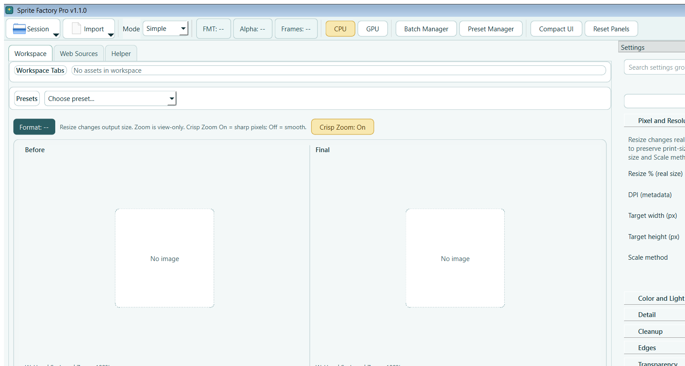

# Sprite Factory Pro

Sprite Factory Pro is a Windows desktop app for sprite and image cleanup, enhancement, and export. It is built for people who need to process many assets quickly without losing control over quality.

[Latest release](https://github.com/Awetspoon/SpriteFactory/releases/latest) | [All releases](https://github.com/Awetspoon/SpriteFactory/releases) | [Docs index](docs/README.md)



## Latest Update

- [Release 1.2.0 notes](docs/RELEASE_1.2.0.md)

## What The Program Does

- Imports sprites/images from local files, folders, ZIP archives, and web pages
- Detects and lists downloadable image links from URL scan areas
- Lets you apply presets or manual controls for cleanup/upscale/detail/transparency
- Shows side-by-side preview (`Current` and `Final`) while editing
- Exports to `PNG`, `WEBP`, `JPG`, `GIF`, `ICO`, `TIFF`, and `BMP`
- Runs batch exports with progress, cancellation, and auto-export queueing
- Saves sessions so users can reopen and continue work later

## Core Workflow

1. Start a new session from the top toolbar.
2. Import assets from the `Import` dropdown (file/folder/ZIP) or use `Web Sources`.
3. Pick a preset from the preset dropdown.
4. Fine-tune controls in `Settings` (resolution, detail, cleanup, transparency, export).
5. Click `Apply` for preview updates.
6. Export one asset, or open `Batch Manager` to export selected items automatically.

## Web Sources (URL Scanner)

- `Scan Area` scans a website area and collects direct + likely media links.
- `Network Check` helps diagnose DNS/TCP/HTTP access issues.
- Friendly errors are shown for common blockers:
  - `WinError 10013` (Windows blocked network access)
  - `HTTP 403` (site blocked automated requests)
  - `HTTP 429` (rate limited)
- If a site blocks scans, use a direct file URL where possible.

## Requirements

- Windows 10/11
- Python 3.11+
- PySide6
- Pillow
- PyInstaller (build only)

## Run From Source

Quickest launch:

```powershell
py -m image_engine_app
```

Package-style launch:

```powershell
py .\main.py
```

One-click launcher with local virtualenv setup:

```powershell
powershell -ExecutionPolicy Bypass -File .\run_app.ps1
```

By default, runtime data now lives in the normal app-data location (`%LOCALAPPDATA%\image_engine_app` on Windows) instead of writing `_runtime_data` into the repository root.

Manual environment setup:

```powershell
py -m venv .venv
.\.venv\Scripts\Activate.ps1
pip install -U pip
pip install -e .
py -m image_engine_app
```

## Build Windows EXE

One-file release build:

```powershell
powershell -ExecutionPolicy Bypass -File .\build_exe_onefile.ps1
```

Output:

- `.local\pyinstaller\dist\SpriteFactory.exe`
- `.local\release\SpriteFactory-v1.2.0-win64.exe` for direct GitHub release upload

Folder (onedir) build:

```powershell
powershell -ExecutionPolicy Bypass -File .\build_exe.ps1
```

Output:

- `.local\pyinstaller\dist\SpriteFactory\SpriteFactory.exe`
- `.local\release\SpriteFactory-v1.2.0-win64-onedir.zip`

## GitHub Upload Readiness

Before pushing or publishing:

- Keep local junk out of the repo: `.venv/`, `.cache/`, `.local/`, `build/`, `dist/`, and `_runtime_data/` are ignored.
- Use the one-file build if you want a single GitHub release download:
  - `powershell -ExecutionPolicy Bypass -File .\build_exe_onefile.ps1`
  - upload `.local\release\SpriteFactory-v1.2.0-win64.exe`
- Use the onedir build only if you specifically want the unpacked folder version.
- Run the test suite before upload:
  - `.\.venv\Scripts\python.exe -B -m unittest discover -s image_engine_app\tests -p "test_*.py"`
- Check [docs/RELEASE_CHECKLIST.md](docs/RELEASE_CHECKLIST.md) for the practical release pass.

## Tests

```powershell
.\.venv\Scripts\python.exe -B -m unittest discover -s image_engine_app\tests -p "test_*.py"
```

## Repository Layout

```text
pyproject.toml      # repo-root Python project manifest
image_engine_app/
  app/              # startup/controller/settings
  ui/               # main window + coordinators/widgets/dialogs
  engine/           # ingest/process/analyze/export/batch
  tests/            # automated tests

image_engine_v3/     # staged rebuild track
pyinstaller_rthooks/ # runtime hooks for frozen build
docs/                # repo docs and screenshots
.local/              # ignored local dev/build/audit artifacts
```

## License

[MIT](LICENSE)
