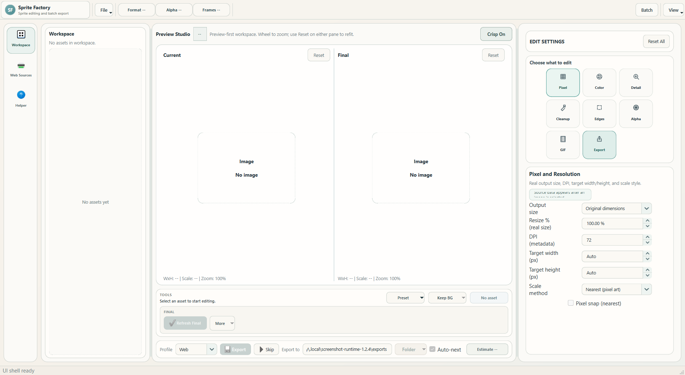

# Sprite Factory

[](https://github.com/Awetspoon/SpriteFactory/releases/latest)
[](https://github.com/Awetspoon/SpriteFactory/releases/latest)
[](LICENSE)

Sprite Factory is a focused Windows editor for sprites, animated GIFs, icons, photos, and other image assets. Import one file or a whole collection, compare the source with the edited result, make precise adjustments, and export individual files or a complete batch.

[**Download Sprite Factory for Windows**](https://github.com/Awetspoon/SpriteFactory/releases/latest) | [Update Notes](docs/RELEASE_1.2.4.md) | [Help and troubleshooting](docs/TROUBLESHOOTING.md)



## Download And Start

1. Open the [latest GitHub release](https://github.com/Awetspoon/SpriteFactory/releases/latest).
2. Under **Assets**, download `SpriteFactory-v1.2.4-win64.exe`.
3. Open the downloaded file. No installer or Python setup is required.
4. Use **File > Add Files** or **File > Add Folder** to begin.

Windows may display a SmartScreen warning because the community build is not code-signed. Only continue when the file came from the official `Awetspoon/SpriteFactory` release page.

## What You Can Do

- Compare **Current** and **Final** side by side before anything is exported.
- Adjust size, DPI, color, lighting, detail, cleanup, edges, transparency, GIF playback, and output encoding.
- Remove white or black backgrounds only when you choose to; importing never removes a background automatically.
- Apply compatibility-aware presets or save your own preset from the active controls.
- Process mixed image collections through the isolated Batch Manager.
- Collect files from public web pages and keep useful websites and pages in a reusable Saved Library.
- Export PNG, WEBP, JPG, GIF, ICO, TIFF, or BMP with profile, naming, resize, and metadata options.

## Your First Edit

1. Add an image, animated GIF, folder, or ZIP archive from the **File** menu.
2. Select an asset in the Workspace. Current shows the original source and Final shows the result that will be exported.
3. Choose a compatible preset or open an Edit Settings category and make small adjustments.
4. Watch Final refresh, use a reset action if needed, then choose **Export**.

The controls begin from detected source data such as dimensions, DPI, transparency, frame count, and GIF playback metadata. Enhancement values stay neutral until you change a control or choose a preset.

## Saved Library And Web Sources

Web Sources can scan one page, many pasted pages, saved library pages, or selected pages discovered from an index.

- **Scan Pages** accepts one full URL per line, including pages from different websites.
- **Saved Library** groups saved pages under their website, so one Project Pokemon entry can contain its root, sprite index, generations, and any other pages you choose to keep.
- **Find Linked Pages** discovers pages from an index without scanning or downloading them automatically.
- **Save Selected to Library** keeps useful discovered pages with their names for future scans.
- **Found Files** accumulates unique results across scans until you explicitly clear it.
- Search, hidden-word, and file-type filters help narrow large result lists without deleting stored results.

Large scans are capped and require confirmation. Some sites may block automated requests or use JavaScript-only pages that a static scanner cannot read. Please respect each website's terms, copyright, and rate limits.

## Presets And Batch

Preset Studio, Workspace, recommendations, and Batch use the same preset library. System presets are safe templates; experienced users can create a user preset from controls changed on the active asset.

Batch Manager keeps queue processing separate from the live editor. Choose one clear edit source for a run: retain each asset's controls, apply one preset, copy the active controls, or smart-match compatible assets. Background behavior, naming, output folder, and export options remain explicit.

## Supported Files

| Purpose | Formats |
| --- | --- |
| Import | JPG/JPEG, PNG, WEBP, TIF/TIFF, BMP, ICO, GIF, and ZIP archives containing supported images |
| Export | PNG, WEBP, JPG, GIF, ICO, TIFF, and BMP |

Animated GIF preview and export preserve frame timing, looping, transparency, palette, and dithering choices through the shared frame pipeline.

## Privacy And Local Data

Local image editing and export happen on your computer. Web Sources makes network requests only to pages and files you ask it to scan or download. Settings, sessions, caches, logs, and default exports are stored in the app's local data directory and are not committed to this repository.

## Run From Source

Source requirements are Windows 10/11, Python 3.11 or newer, Pillow, and PySide6.

```powershell
py -m venv .venv
.\.venv\Scripts\Activate.ps1
pip install -U pip
pip install -e .
powershell -ExecutionPolicy Bypass -File .\run_app.ps1
```

## Build And Test

Build the verified single-file Windows release:

```powershell
powershell -ExecutionPolicy Bypass -File .\build_exe_onefile.ps1
```

Run the repository health audit:

```powershell
powershell -ExecutionPolicy Bypass -File .\RUN_AUDIT.ps1
```

The release build runs the complete automated suite and a frozen-application launch test before producing `.local\release\SpriteFactory-v1.2.4-win64.exe`. Generated builds, runtime data, caches, and local settings are ignored by Git.

## Documentation

- [Update notes](docs/RELEASE_1.2.4.md)
- [Troubleshooting](docs/TROUBLESHOOTING.md)
- [Web Sources guide](docs/WEB_SOURCES_README.md)
- [Project structure](docs/PROJECT_STRUCTURE.md)
- [Release checklist](docs/RELEASE_CHECKLIST.md)

## License

Sprite Factory is available under the [MIT License](LICENSE).
