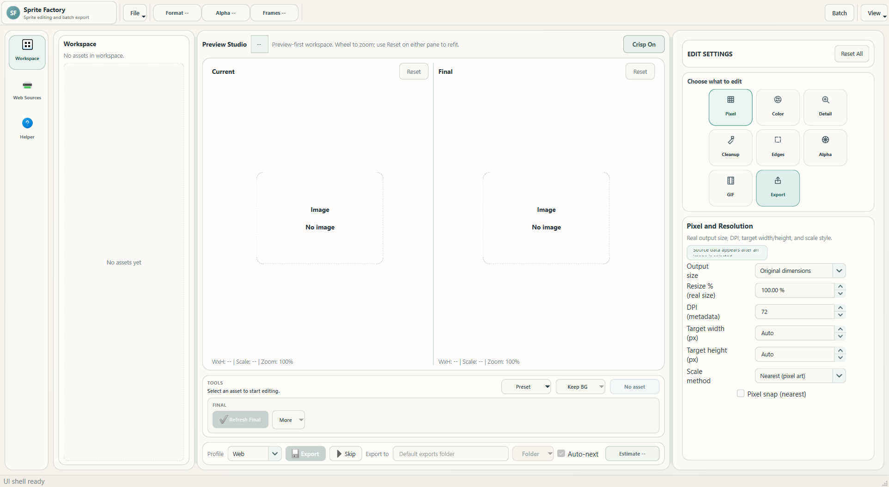

# Sprite Factory 1.2.3 Release Notes

Sprite Factory 1.2.3 completes the clean editor rebuild and makes repeat web scanning much easier with the new Saved Library.

## Saved Library

- Websites now act as library folders containing every page saved from that host.
- Save pasted pages directly, or save selected pages discovered from an index page while keeping their useful names.
- Check one page, several pages, a whole website, or pages from different websites and scan them together.
- Duplicate page URLs are ignored and existing saved libraries migrate automatically.
- `Scan Checked` now processes exactly the checked pages instead of silently falling back to a highlighted row.

## Editing And Preview

- Current remains the imported source while Final shows the controls or preset that will be exported.
- Detected size, DPI, transparency, animation, and GIF playback data provide a neutral starting baseline.
- Control and preset changes rebuild Final without stacking hidden edits.
- Per-control reset actions restore individual values, while Reset All restores the complete detected baseline.
- Static and animated assets use the same frame-processing rules for preview, Batch, and export.

## Presets, Batch, And Export

- Workspace, Preset Studio, recommendations, and Batch share one compatibility-aware preset library.
- User presets can be created from the active asset's changed controls and reused across compatible formats.
- Batch works on isolated copies so queue edits do not alter the live workspace.
- Interactive and Batch exports share format, resize, naming, animation, and encoding behavior.
- Supported output formats include PNG, WEBP, JPG, GIF, ICO, TIFF, and BMP.

## Interface And Reliability

- The preview-first shell, control dock, export bar, settings panel, Batch Manager, and Preset Studio now use one consistent visual system.
- Startup, imports, editing, presets, Web Sources, Batch, persistence, and export have explicit service boundaries.
- Retired V3 scaffolding, duplicate coordinators, old mockups, copied state paths, and superseded processing helpers were removed.
- The Helper and public documentation now match the actual application.

## Download

Download `SpriteFactory-v1.2.3-win64.exe` from the Assets section below. It runs on 64-bit Windows 10 or Windows 11 and does not require Python.

Windows may show a SmartScreen warning because this community release is not code-signed. Confirm that the publisher is unknown only if you downloaded the file from this official GitHub repository.

## Verification

The release pipeline compiles the package, runs the complete automated suite, checks repository and release metadata, builds the Windows executable, verifies its embedded version and icon, and launches the frozen application in smoke-test mode.
